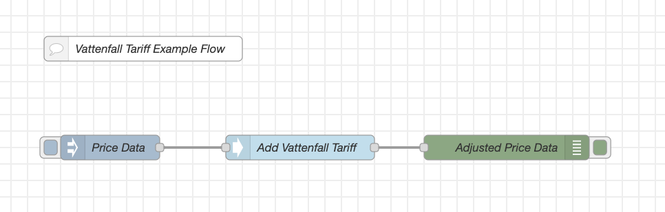

# node-red-contrib-vattenfall-tariff

## Vattenfall Tariff Node Red Node

## Description

Adds a fixed amount to the price data based on the time of day and month of the year and if the day is a working det or not, following the Vattenfall time tariff.

### Inputs

: _payload.priceData_ (Array) : A array of price data objects. Each object should have a start and a value property.

### Outputs

: payload.priceData (Array) : The input array with the value property adjusted based on the time of day and month of the year.

### Details

The node expects an array of price data objects. Each object should have a start and a value property. The start property should
be a Date object. The value property should be a number. The node will add a fixed amount to the value property based on the time
of day and month of the year and if it is a working day or not, following the Vattenfall tariff. Any other properties in the input
objects will be passed through to the output objects.

The price data shape is combatible with the output of the `ps-receive-price` node from the `node-red-contrib-power-saver` package.

The node has three configuration properties:

- Name : The name of the node.
- High Tariff : The amount to add to the value property during the high tariff period.
- Low Tariff : The amount to add to the value property during the low tariff period.

The node will output an array of price data objects. Each object will have a start and a value property. The start property will
be a Date object. The value property will be a number. Any other properties in the input objects will be passed through to the
output objects.

When calculating the price data the node will use a public API to decide if the current day is a working day or not why the node will not work in a offline environment.

The high tariff period is from 06:00 to 22:00 Europe/Stockholm working days from 1 November to 31 March. All other times are low tariff.

### References

- [Power Saver](https://powersaver.no/)
- [Vattenfall Tariff Price List](https://www.vattenfalleldistribution.se/kund-i-elnatet/elnatspriser/elnatspriser-och-avtalsvillkor/)
- [Svenska Dagar API](https://api.dryg.net/)
